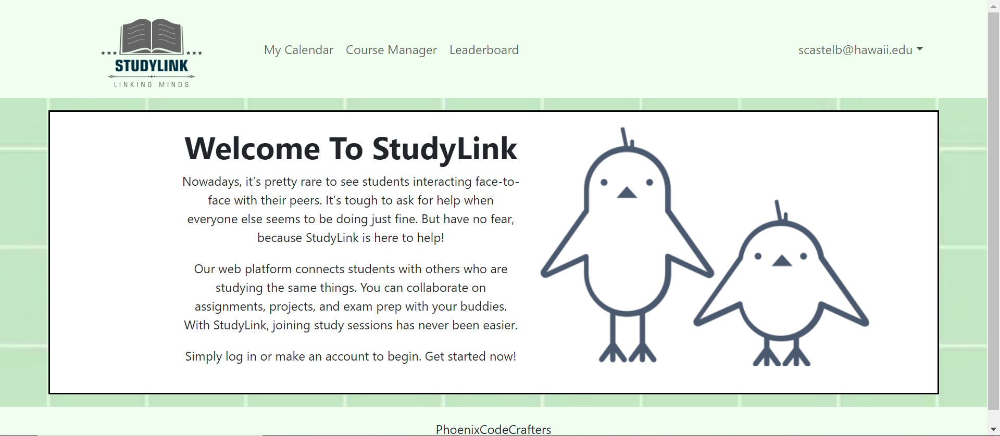

Design patterns are like secret recipes in software development, guiding developers in solving common software challenges. They offer ready-made solutions that save time, make software easy to manage and update, enhance reliability and performance, and help systems grow without becoming unwieldy. For my project, StudyLink, a platform that connects students for collaborative study sessions, these recipes have proven essential in building a robust and efficient system.

Observer Pattern: In the SignUp component, the Observer pattern is embodied through the use of React's useState. This pattern updates the UI reactively whenever the sign-up status changes, as shown here:

---
const [error, setError] = useState('');
---

Factory Pattern: We use the SimpleSchema to define validation rules for our forms, a clear example of the Factory pattern. This schema acts as a blueprint, ensuring all user input adheres to specified validation rules:

---
const schema = new SimpleSchema({ email: String, password: String });
---

Command Pattern: The submission process uses the Command pattern, encapsulating the registration logic within a function that executes when the form is submitted:

---
const submit = (doc) => { Accounts.createUser({ email, password }); };
---

In essence, design patterns have not just shaped our software; they've optimized how students connect and succeed together. Using design patterns and effective project management, we've built a "digital campus" where information flows smoothly, updates are easy, and scalability is built-in. StudyLink, structured around these patterns and enhanced with effective tooling, offers a stable and dynamic environment for academic collaboration, much like a well-planned university that supports its students.
