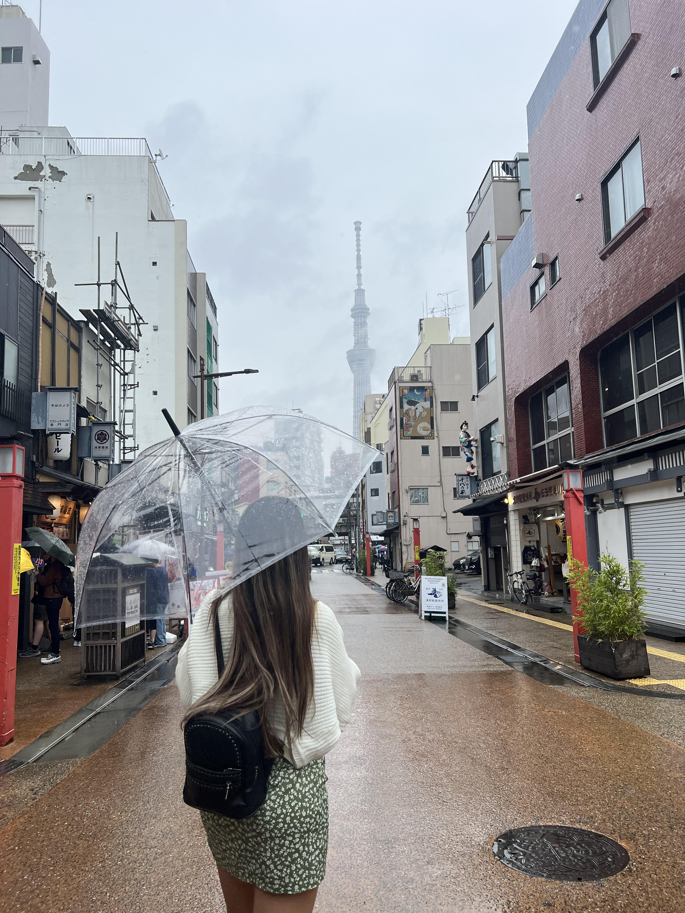

  

Purpose and Objectives: This project was a journey of exploration and discovery of Japan’s attractions, one of the world's most popular tourist destinations. The objectives were to visit three major cities in Japan, Tokyo, Osaka, and Kyoto, and to learn about their unique features and differences.

 
_Being in Japan was a captivating journey. The primary aim was to delve into the unique features and distinctions of each city, offering a comprehensive understanding of Japan’s diverse cultural landscape._

 

## Tokyo
The capital and the largest city of Japan, Tokyo is a metropolis that combines the old and the new, the traditional and the modern, the east and the west. It offers endless possibilities and opportunities for visitors, as well as challenges and surprises. Sampling diverse Japanese cuisine and visiting themed cafes added culinary delights to the journey.

 
### List of places to visit in Tokyo:
*	Visit Shibuya Crossing: Experience the iconic Shibuya Crossing, one of the busiest pedestrian crossings in the world.
*	Explore the vibrant Shibuya district with its trendy shops, cafes, and entertainment options.
*	Explore Shinjuku: Wander through Shinjuku, known for its skyscrapers, shopping centers, and entertainment options. Visit Kabukicho, Tokyo’s famous entertainment and red-light district.
*	Discover Asakusa and Senso-ji Temple: Explore the historic district of Asakusa. Visit Senso-ji Temple, Tokyo’s oldest temple, and Nakamise-dori shopping street.
*	Experience Tokyo Disneyland and DisneySea: Enjoy the magic of Tokyo Disneyland and Tokyo DisneySea for a fun-filled day of entertainment.
*	Relax in Ueno Park: Visit Ueno Park, a large public park featuring museums, a zoo, and cherry blossoms during the spring.
*	Shop in Harajuku: Experience the unique fashion and youth culture in Harajuku. Takeshita Street is famous for its quirky shops and trendy boutiques.
*	Marvel at Tokyo Skytree: Visit Tokyo Skytree, one of the tallest structures in the world, for panoramic views of the city.
*	Indulge in Japanese Cuisine: Sample a variety of Japanese dishes, including sushi, ramen, tempura, and more. Try dining in themed cafes for a unique experience.
*	Relax in an Onsen: Experience a traditional Japanese onsen (hot spring bath) for relaxation and cultural immersion.
*	Discover Tokyo’s Museums: Explore museums such as teamLab Borderless, and the Ghibli Museum.
Osaka: The second largest city and the economic center of Japan, Osaka is known for its friendly and outgoing people, its delicious street food, and its vibrant and historical landmarks. It is a city that is full of energy and fun, as well as history and heritage.

 

## Osaka
Osaka, known for its friendly populace and delicious street food, unfolded its treasures. The city showcased its energetic spirit from the historical Osaka Castle to the vibrant Dotonbori district and the culinary delights of Kuromon Market. Umeda Sky Building and Sumiyoshi Taisha Shrine provided a mix of modernity and tradition, while Universal Studios Japan added a touch of entertainment.

 
### List of places to visit in Osaka:
*	Visit Osaka Castle: Explore Osaka Castle, a symbol of the city’s rich history. • Walk through the castle grounds and enjoy panoramic views from the observation deck.
*	Experience Dotonbori: Wander through Dotonbori, a lively district known for its neon lights, entertainment, and iconic street food. Take a photo with the Glico Running Man sign.
*	Try Street Food in Kuromon Ichiba Market: Indulge in Osaka’s famous street food at Kuromon Ichiba Market. • Try takoyaki (octopus balls), okonomiyaki (savory pancakes), and other local delights.
*	Explore Umeda Sky Building: Visit the Umeda Sky Building for panoramic views of Osaka from its Floating Garden Observatory.
*	Visit Sumiyoshi Taisha Shrine: Experience the tranquil atmosphere of Sumiyoshi Taisha, one of Japan’s oldest Shinto shrines.
*	Relax in Osaka Castle Park: Take a leisurely stroll in Osaka Castle Park, especially beautiful during cherry blossom season.
*	Experience Universal Studios Japan: Spend a day at Universal Studios Japan, enjoying theme park rides and attractions.
Kyoto: The former capital and the cultural heart of Japan, Kyoto is a city that preserves and showcases the beauty and elegance of Japanese culture, art, and architecture. It invites visitors to slow down and appreciate the finer things in life and to reflect and meditate.

 

 
## Kyoto
As Japan's former capital and cultural heart, Kyoto is enchanted with its elegance. Visits to Kyoto’s timeless landmarks, including Fushimi Inari Shrine and Kinkaku-ji, revealed the city’s commitment to preserving Japanese culture. The tranquility of Kyoto’s temples, gardens, and the cherry blossom-lined Osaka Castle Park offered moments of reflection and appreciation.

 
### List of places to visit in Kyoto:
*	Fushimi Inari Taisha: Famous for its thousands of vermillion torii gates, this Shinto shrine is dedicated to Inari, the god of rice and prosperity.
*	Kiyomizu-dera: A UNESCO World Heritage Site, this wooden temple provides panoramic views of Kyoto from its wooden terrace. The temple is particularly beautiful during cherry blossom season.
*	Gion District: Known for its traditional wooden machiya houses, Gion is Kyoto’s historic geisha district. Stroll through its narrow streets and experience the traditional atmosphere.
*	Arashiyama Bamboo Grove: A mesmerizing bamboo forest in the Arashiyama district, along with the iconic Togetsukyo Bridge and the Iwatayama Monkey Park.
*	Ryoan-ji Temple: Famous for its rock garden, Ryoan-ji is a Zen temple that provides a serene and contemplative atmosphere.
*	Nijo Castle: A historic castle with beautiful gardens, Nijo Castle is known for its “nightingale floors” that chirp when walked upon, providing security measures.

 

 

 

**Observation:** Japanese society values harmony and order. Observing the queue system, silence on public transportation, and adherence to unwritten rules showcased a collective commitment to maintaining a peaceful environment. Recognizing and adapting to these social norms became an integral part of experiencing daily life in Japan.

I recommend that future travelers who are planning to visit Japan should:
*	Research and prepare before the trip, such as learning some basic phrases and words in Japanese, checking the weather and seasonal events, and booking flights and accommodation in advance.

*	Be flexible and open-minded during the trip, such as trying new foods and activities, respecting the local rules and norms, and embracing the unexpected and the unfamiliar.

*	Enjoy and appreciate the trip, such as taking photos and videos, keeping a journal or a blog, and sharing the stories and memories with others.

