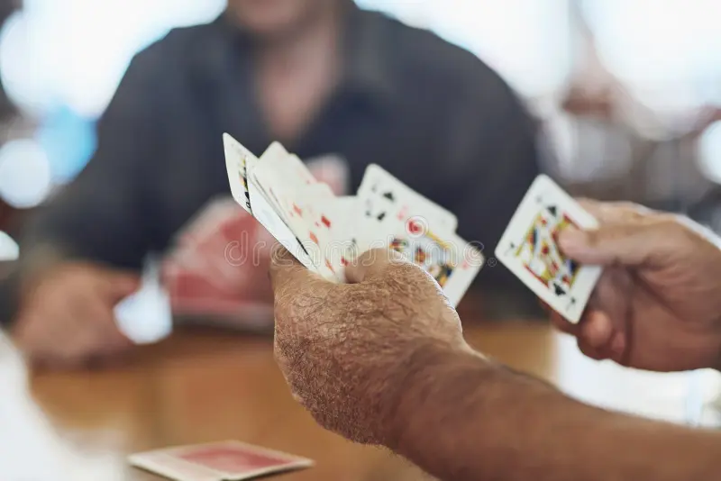

 
  

 

**Project Overview:**
The project I was involved in aimed to bring joy, social interaction, and cognitive stimulation to seniors by encouraging them to play card games. As a volunteer, I spent a considerable amount of time with the seniors who were eager to participate in the card games. I found it to be a fantastic way to spend my afternoons. Card games allow Seniors to connect, build friendships, and maintain mental agility. The environment was always supportive, and the seniors were engaged in the games. It was heartwarming to see how the seniors would come alive and enjoy the games, bringing a sense of purpose and happiness.

During my high school years, I was fortunate enough to assist in this project, and it was a gratifying experience to see the happiness it brought to seniors. This project enabled connections between seniors and younger participants, which provided a mutually enjoyable experience. 

As a volunteer, I helped to print materials with game rules and strategies and assisted the seniors in playing the card games. I also engaged in conversations with them, listened to their stories, and shared their experiences. Overall, the project was a success, and I am grateful for the opportunity to participate in it.

 

**Objectives:**
Provide seniors with regular opportunities for social interaction and connection.
Foster a sense of community through shared card-playing experiences.
-	Stimulate cognitive functions by engaging seniors in strategic and memory-based card games.
-	Promote mental agility and concentration through the enjoyment of games.
-	Emotional Well-being:

Enhance emotional well-being by creating a positive and enjoyable atmosphere during card-playing sessions.
Reduce feelings of loneliness and isolation through social bonding.
Skill Building:
Offer opportunities for seniors to learn and practice various card games.
Provide guidance and support to help seniors develop and improve their card-playing skills.
Program Components:
1. Weekly Card Sessions:
It was organize weekly card-playing sessions in local gathering places.
2. Card Game Tutorials:
Conduct tutorials or workshops to teach poker card to seniors.
Provide printed materials with the game rules and strategies for reference.
6. Memory-Boosting Card Games:
Include memory-boosting card games that require participants to match pairs or recall sequences.
Enhance cognitive abilities while maintaining an enjoyable and relaxed atmosphere.

In conclusion, being part of a project that brought joy, social interaction, and cognitive stimulation to seniors through card games has been a rewarding experience. I learned that simple activities such as playing card games can have a profound impact on seniors' well-being. The games fostered connections, built friendships, and maintained mental agility among the seniors. My role involved setting up game sessions, providing guidance, and listening to their stories. The project achieved its goals of providing regular social interaction, stimulating cognitive functions, and enhancing emotional well-being. It was gratifying to contribute to a program that brought joy to seniors and facilitated intergenerational connections and skill-building opportunities. I learned the importance of creating inclusive and enriching experiences for seniors to thrive in their communities.

 

<pre>
"Card Connections for Seniors" aims to create a welcoming and enjoyable space where seniors can connect, have fun, and keep their minds active through the timeless enjoyment of playing cards.

</pre>

