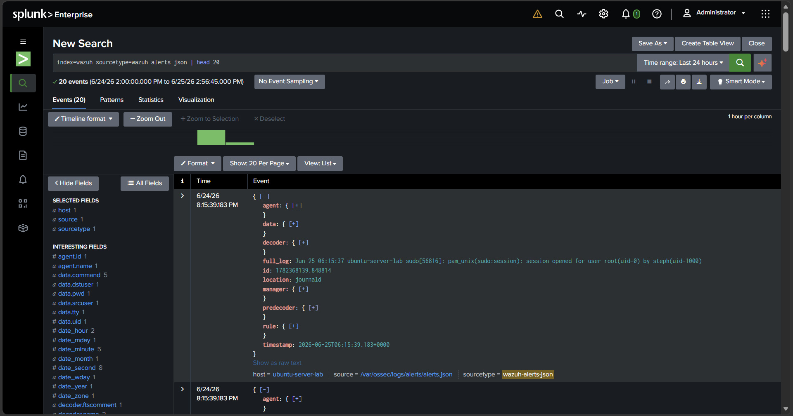
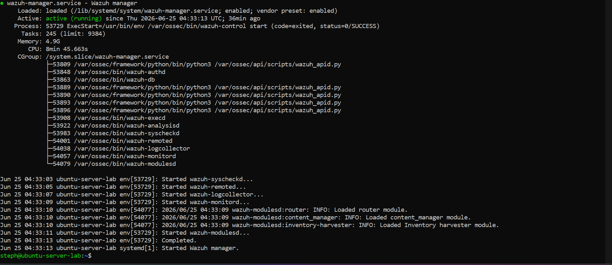
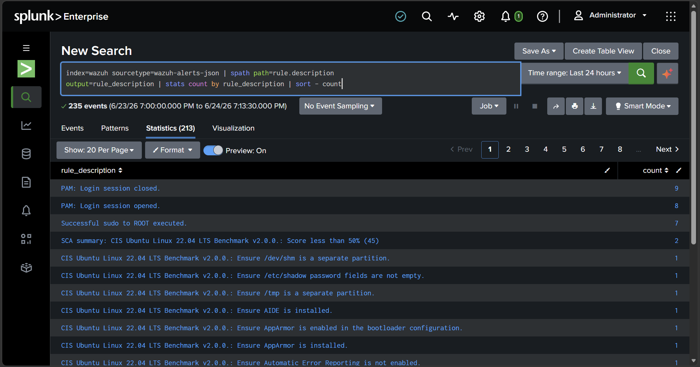
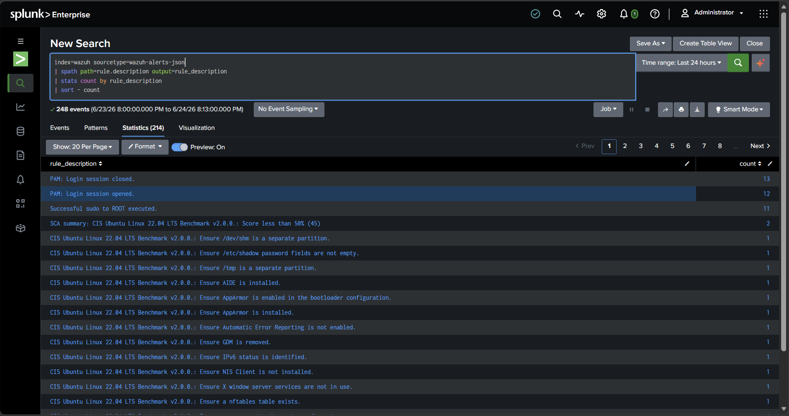

<br />

  




## What this project is

I connected two popular security tools so they work together:

- **Wazuh** watches a computer and writes down anything suspicious (someone logging in, using admin powers, etc.). Think of it as the **security camera**.
- **Splunk** collects all those notes in one place so you can search them fast. Think of it as the **search engine for the camera footage**.

My job was to make Wazuh's alerts automatically travel into Splunk, then prove the data arrived by searching it. This is exactly what a **SOC (Security Operations Center)** — the team that watches for cyberattacks — does all day.

## The tools, explained simply

| Tool | What it does |
| --- | --- |
| **Wazuh** | The security camera. Spots suspicious activity and writes it down. |
| **Splunk** | The search engine. Stores all the alerts so you can look through them fast. |
| **Universal Forwarder** | The delivery truck. Carries Wazuh's notes over to Splunk. |
| **Ubuntu Server** | The computer Wazuh runs on. |
| **Windows host** | The computer Splunk runs on. |

A couple of words that show up a lot:

- **SIEM** = Security Information and Event Management. A fancy term for a tool that collects security alerts in one place and lets you search them. Splunk is a SIEM.
- **SPL** = Splunk Processing Language. The way you *ask Splunk questions*, like typing a search into Google. Example: `index=wazuh` means "show me the Wazuh alerts."

## How it works

```
Wazuh (security camera)
        │
        │  alerts get picked up
        ▼
Universal Forwarder (delivery truck)
        │
        │  carries them across
        ▼
Splunk (search engine) — now I can search every alert
```

## What I did, step by step

1. Set up Wazuh on the Ubuntu computer so it started writing down alerts.
2. Installed the "delivery truck" (Universal Forwarder) to carry those alerts.
3. Set up a labeled folder in Splunk (called `wazuh`) to keep the alerts organized.
4. Opened the right "door" (network port 9997) so the two computers could talk.
5. Searched Splunk and confirmed the alerts had arrived.

## Proof it worked

**1. Wazuh is running and watching** — the security camera is on.



**2. The alerts arrived in Splunk** — I searched and the security notes showed up.


**3. The alert file exists** — proof Wazuh was writing down activity.


**4. Alerts sorted by how serious they are** — low, medium, and higher-priority counts.



**5. The most common alerts** — logins, admin (sudo) use, and security check results.



## What I learned

- **Two tools, one pipeline.** Getting separate security tools to talk to each other is a core SOC skill.
- **The right setup matters.** If a network "door" (port 9997) is closed, no data flows — a common real-world problem.
- **Searching is the job.** Once data is in Splunk, asking the right questions (with SPL) is how an analyst finds threats.
- **Troubleshooting counts.** I hit a few snags — a missing alert file, a closed firewall door — and fixed each one.

<!-- ============================================================
     PRIVATE — FOR MY EYES ONLY
     (This whole block is hidden on the published page.
     It only shows when you open the raw file.)

     MY 30-SECOND INTERVIEW SCRIPT:
     "I connected Wazuh, which watches computers for suspicious
     activity, to Splunk, which is a search tool for security data.

     I set it up so Wazuh's alerts automatically flow into Splunk,
     then I searched Splunk to confirm everything arrived and sorted
     the alerts by how serious they were. It's the same basic
     workflow a Security Operations Center uses to catch attacks."

     If someone asks "what's SPL?" → "It's how you search in Splunk,
     like typing into Google."
============================================================ -->

---

*Project A of a 4-part security home-lab portfolio.*
