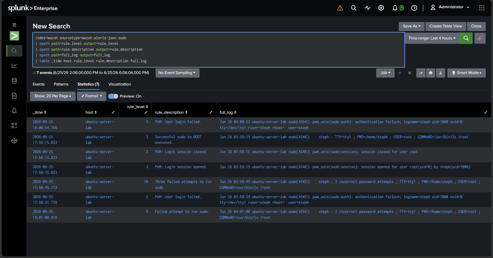

<br />

  


## What this project is

This project connected **Wazuh** and **Splunk** together.

- **Wazuh** watched my Ubuntu server and created security alerts.
- **Splunk** received those alerts so I could search and analyze them.

Simple explanation:

> **Wazuh finds alerts. Splunk helps me search the alerts.**

This is a basic SOC workflow. A SOC analyst needs to collect security data, search it, and understand what happened.

## Tools used

- **Ubuntu Server:** The machine being monitored.
- **Wazuh Agent:** Watched the Ubuntu server for activity.
- **Wazuh Manager:** Processed the activity and created alerts.
- **Splunk Universal Forwarder:** Sent Wazuh alerts from Ubuntu to Splunk.
- **Splunk Enterprise:** Stored and searched the alerts.
- **Windows Host:** Ran Splunk Enterprise and received logs on port `9997`.

## How it works

```text
Ubuntu Server
   ↓
Wazuh detects activity
   ↓
Wazuh writes alerts to alerts.json
   ↓
Splunk Universal Forwarder sends the alerts
   ↓
Splunk receives the alerts
   ↓
I search the alerts in Splunk
```

## What I did

1. Confirmed the Wazuh Manager was running on Ubuntu.
2. Installed the Wazuh Agent on the Ubuntu server.
3. Confirmed the Wazuh Agent was active.
4. Installed the Splunk Universal Forwarder on Ubuntu.
5. Created a Splunk receiving port on `9997`.
6. Created a Splunk index named `wazuh`.
7. Forwarded this Wazuh alert file into Splunk:

```bash
/var/ossec/logs/alerts/alerts.json
```

8. Created safe test activity so Wazuh would generate alerts.
9. Searched Splunk to confirm the alerts arrived.

## How I created test alerts

At first, there were not many alerts because my Ubuntu server was quiet.

That helped me understand something important:

> **No activity means no alerts.**

To test the setup safely, I created simple activity on Ubuntu, like failed `sudo` attempts. This caused Wazuh to generate alerts.

Then I checked the Wazuh alert file:

```bash
sudo tail -n 20 /var/ossec/logs/alerts/alerts.json
```

After that, I searched for the alerts in Splunk.




## Splunk searches I used

Show Wazuh events:

```spl
index=wazuh | head 20
```

Count alerts by rule description:

```spl
index=wazuh | stats count by rule.description | sort -count
```

Count alerts by severity level:

```spl
index=wazuh | stats count by rule.level | sort -rule.level
```

## Proof it worked

**1. Wazuh Manager was running**


**2. Wazuh alerts arrived in Splunk**


**3. The Wazuh alert file existed on Ubuntu**


**4. Alerts counted by severity level** — levels 3  (144), 4 (1), 5 (1), and 7 (109).


**5. Common alert types** — PAM logins, successful sudo to root, and CIS Ubuntu benchmark findings


## What I learned

- **Wazuh detects security activity.**
- **Splunk helps search and analyze alerts.**
- **The Universal Forwarder moves logs from one system to another.**
- **Port `9997` must be open so Splunk can receive logs.**
- **If there is no activity, there may be no alerts.**
- **Creating safe test activity is a good way to prove the pipeline works.**


<!-- ============================================================
PRIVATE — FOR MY EYES ONLY


## Interview explanation

If someone asks me about this project, I can say:

> I built a small SOC lab using Wazuh and Splunk. Wazuh monitored my Ubuntu server and created alerts. Then I used the Splunk Universal Forwarder to send those alerts into Splunk. I created safe test activity, like failed sudo attempts, and confirmed the alerts appeared in Splunk.

Short version:

> **Wazuh finds alerts. Splunk analyzes alerts.**


30-SECOND INTERVIEW SCRIPT:

"I built a small SOC lab with Wazuh and Splunk. Wazuh watched my
Ubuntu server and created security alerts. I used the Splunk Universal
Forwarder to send those alerts into Splunk. Then I searched the alerts
in Splunk to confirm the data was working.

One thing I learned is that if nothing happens on the server, there may
not be many alerts. So I created safe test activity, like failed sudo
attempts, to prove Wazuh was detecting activity and Splunk was receiving it."

MEMORY:
Wazuh = detects alerts
Splunk = searches alerts
Ubuntu = monitored machine
Windows = Splunk machine

TO DO: add screenshot of the failed sudo test next lab session.
============================================================ -->

---

*Project A of a 4-part security home-lab portfolio.*
