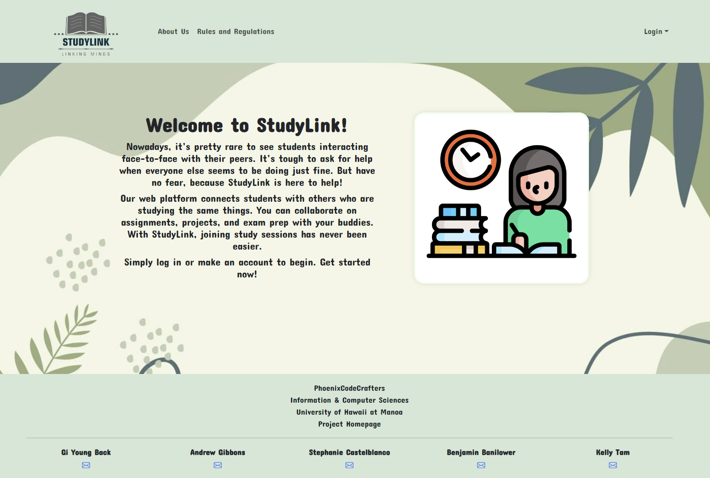

 
  
During my time working on StudyLink, I learned the importance of effective teamwork and project management. By utilizing tools such as Meteor, React, and project boards, I was able to significantly improve our team's efficiency and ensure that we met our project timelines. This experience helped me to deepen my understanding of agile and iterative development methodologies. Furthermore, working on StudyLink allowed me to enhance my full-stack development skills, as I gained practical experience in setting up databases, designing user interfaces, and integrating important libraries such as Fullcalendar.

## Project Overview
StudyLink is a dynamic web platform designed to facilitate academic collaboration among students. It offers comprehensive tools for creating, managing, and attending study sessions, equipped with an integrated calendar and a user-friendly interface to enhance the learning experience.

## Responsibilities
- Full Stack Development: Developed the application using Meteor and React, ensuring a seamless front-end user experience linked to a MongoDB backend.
UI/UX Design: Crafted a responsive web interface with React-Bootstrap, prioritizing accessibility and user comfort.
- Feature Implementation: Led the creation of pivotal features such as account registration, group formation, and real-time updates on session scheduling.
Database Management: Oversaw the configuration and management of MongoDB databases for secure handling of user and session data.
- Testing and Deployment: Managed the testing phase with ESLint to maintain code quality and deployed the application with Meteor's build system for optimal performance.
- User Feedback Integration: Engaged continuously with the user community to integrate feedback and refine platform functionalities.

## Achievements
- Launch and Adoption: Successfully launched and saw widespread use at [University/UH Manoa], becoming a vital tool for academic collaboration.
-Calendar System Integration: Implemented a robust Fullcalendar system, receiving accolades for its functionality and impact on scheduling.
- Admin Panel Development: Constructed a comprehensive admin panel that streamlined the management of user sessions and profiles, enhancing platform governance and security.

## Learning Outcomes
- Advanced Full-Stack Development: Mastered full-stack development with a focus on real-time applications using Meteor and React.
- User-Centric Design Proficiency: Sharpened my UI/UX design skills, ensuring the platform aligns with user needs and expectations.
- Enhanced Project Management Skills: Strengthened project management and collaborative abilities, crucial for leading multidisciplinary teams and meeting project deliverables effectively.
